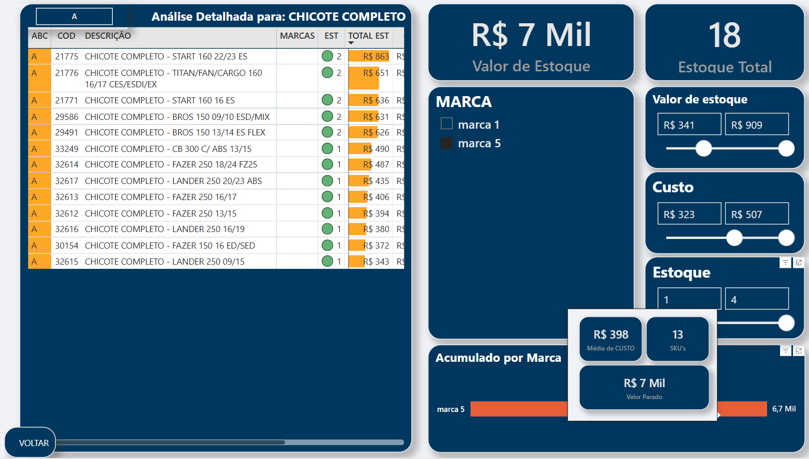
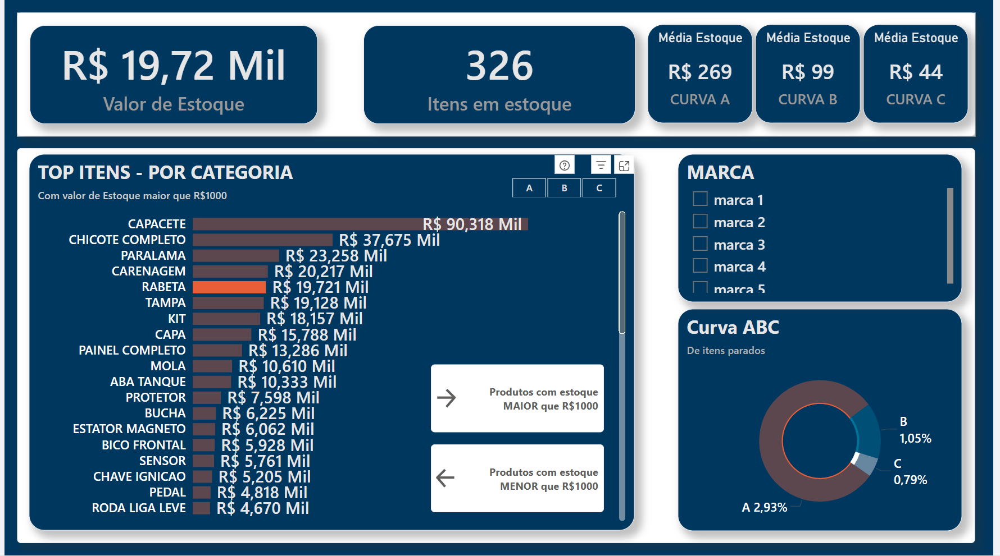
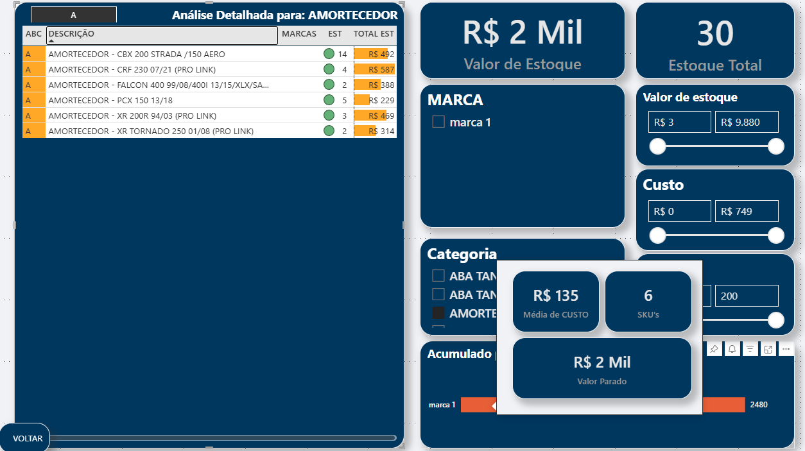

# analise-estoque-powerbi
analise-estoque-powerbi
# Dashboard de Análise de Estoque Parado
<p align="center">
  
  
  
  
</p>



## 🎯 Resumo do Projeto

Este projeto foi desenvolvido para analisar o problema de estoque sem giro em uma empresa de distribuição. O objetivo é transformar dados brutos de inventário em um dashboard interativo que permita à gestão identificar rapidamente os principais focos de capital empatado, analisar as causas raiz por categoria e marca, e tomar decisões estratégicas para otimizar o inventário.

**[🔗 Clique aqui para acessar o Dashboard Interativo](https://app.powerbi.com/view?r=eyJrIjoiY2U4OGRmYTctNDE1Yy00ZDVjLWIyZTYtODAwODZiZTkxNWMyIiwidCI6IjMyNDFkMzllLTdiZDEtNDQ2My05ZGFmLWU2M2M2MWZjOWRkYyJ9)**

---

## 🛠️ Ferramentas e Tecnologias

* **Power BI Desktop:** Ferramenta principal para desenvolvimento, modelagem e criação dos visuais.
* **DAX (Data Analysis Expressions):** Utilizado para criar todas as métricas, classificações (Curva ABC) e as lógicas de interatividade avançada.
* **Power Query:** Utilizado para a conexão, limpeza e tratamento inicial dos dados a partir dos arquivos CSV.
* **Design de UI/UX:** Aplicação de conceitos de hierarquia visual, paleta de cores consistente e formatação condicional para criar uma experiência de usuário intuitiva.

---

## 🚀 Funcionalidades e Análises Principais

* **KPIs Estratégicos:** Análise do valor total parado, quantidade de SKUs afetados e um detalhamento do Ticket Médio por Curva de Relevância (A, B, C).
* **Análise de Pareto (Curva ABC):** Segmentação automática dos produtos nas curvas A, B e C para focar os esforços nos itens que representam 80% do valor parado.
* **Navegação por Drill-through:** Funcionalidade que permite uma jornada de análise do resumo geral (por categoria) para uma visão detalhada (por produto) com um simples clique.
* **Tooltips Interativos:** Dicas de ferramenta personalizadas que mostram a lista de SKUs específicos de uma marca ao passar o mouse, aprofundando a análise sem poluir a tela.
* **"Tabela Inteligente" com Formatação Condicional:** Uma tabela de dados que usa cores, ícones e barras para sinalizar visualmente a prioridade, o risco de volume e a rentabilidade de cada item.

---

## 📊 Estrutura do Dashboard

O relatório é composto por duas páginas principais e páginas de suporte para tooltips:

### Página 1: Resumo Executivo
Visão macro do problema, ideal para a diretoria. Responde "Qual o tamanho do problema e onde ele está concentrado?".
#### Página 1: Visão Geral



### Página 2: Análise Detalhada
Página de ação para gestores. Acessada via drill-through, permite a investigação em nível de produto e categoria. Responde "Quais são os itens e marcas exatos que precisam de atenção?".



---

## 💡 Lógica DAX de Destaque

A lógica central do projeto reside na coluna calculada `CURVA ABC`, que segmenta dinamicamente todos os produtos com base no Princípio de Pareto. A fórmula utiliza variáveis para ranquear, acumular e calcular a participação de cada produto no valor total.

```dax
CURVA ABC = 
-- Ranqueia os produtos usando a coluna de valor que está na própria tabela.
VAR RankingValor = RANKX(ALL('Dim_Produto'), 'Dim_Produto'[VALOREST], , DESC)

-- Calcula o valor total de todos os produtos na tabela Dim_Produto.
VAR ValorTotal = SUM('Dim_Produto'[VALOREST])

-- Calcula o valor acumulado.
VAR ValorAcumulado =
    CALCULATE(
        SUM('Dim_Produto'[VALOREST]),
        FILTER(
            ALL('Dim_Produto'),
            RANKX(ALL('Dim_Produto'), 'Dim_Produto'[VALOREST], , DESC) <= RankingValor
        )
    )

-- Calcula a porcentagem acumulada.
VAR PctAcumulado = DIVIDE(ValorAcumulado, ValorTotal)

RETURN
    SWITCH(
        TRUE(),
        PctAcumulado <= 0.8, "A",  -- Os primeiros 80% do valor
        PctAcumulado <= 0.95, "B", -- Os próximos 15% do valor
        "C"                       -- Os últimos 5%
    )
```

## Autor
[](https://www.linkedin.com/in/carlos-vinicius-nascimento-de-jesus/)
[](https://github.com/Carllux/)
